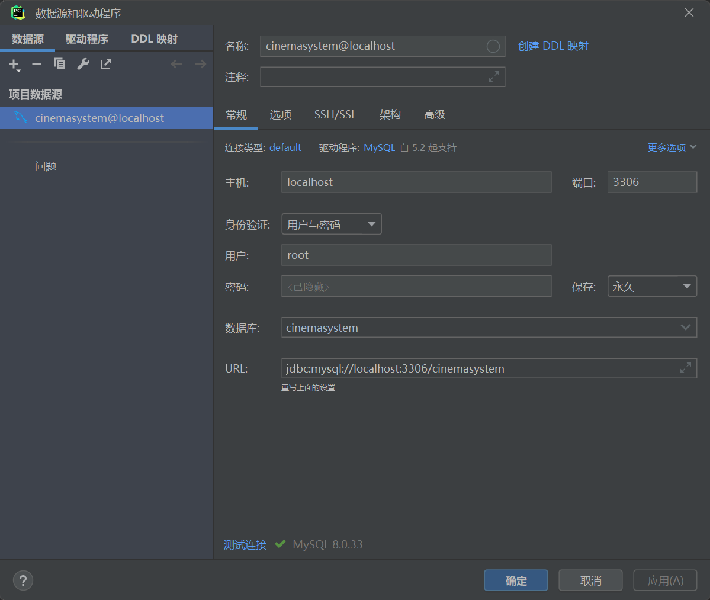
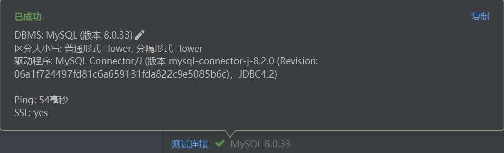

# 视成影院


## 一、项目概述
**视成影院**是我个人设计的一个**简易影院网站**，旨在为用户提供**更便捷、更直观、更友好**的观影体验。

其优势在于：

- 影院提供来自**猫眼电影排行榜前100的电影**供用户自由选择，每部电影都是经典中的经典，值得反复观看
- 影院配置有激光厅、巨幕厅、4DX厅、ScreenX厅、杜比全景声厅、4K厅共**6种不同的放映室选择**，带给用户丰富的观影体验
- **观影时间自由**，电影会准时在购票的下一个整点放映
- 支持**自由选择观影座位**，用户以先购票先选座的形式选择座位
- 支持**无条件退票**，只要在电影放映之前的任何时间都可以一键退票

## 二、开发环境与技术
- 开发环境：
    - Pycharm 2023.1 
    - Django 4.2.1
    - MySQL 8.0.33
- 开发技术：
    - 前端：HTML + CSS + JavaScript
    - 后端：Python + Django + PyMySQL
    - 数据库：MySQL
    - 爬虫技术：requests + BeautifulSoup
- 代码管理：
    - git 2.44.0

## 三、使用方法

### 配置数据库
在Pycharm界面右侧边栏点开数据库，新增数据源，选择MySQL，填入对应信息，并测试连接，连接成功即可。

<div align=center>
    
</div>

<div align=center>
    
</div>

### 在代码中添加数据库信息
在`CinemaSystem/settings.py`中第78行处，分别修改USER和PASSWORD为MySQL数据库对应的用户名和密码。
```python
DATABASES = {
    'default': {
        'ENGINE': 'django.db.backends.mysql',
        'NAME': 'cinemasystem',
        'USER': '(此处填入mysql用户名)',
        'PASSWORD': '(此处填入mysql密码)',
        'HOST': '127.0.0.1',
        'PORT': '3306',
    }
}
```

### 数据库迁移
在终端输入以下指令完成数据库迁移：
```shell
python manage.py migrate
```

### 添加超级管理员
在终端输入以下指令添加超级管理员：
```shell
python manage.py createsuperuser
```

### 手动添加用户、放映厅信息
启动程序，进入超级管理员界面：`http://127.0.0.1:8000/admin/`, 添加用户、放映厅和电影信息。（只有1号用户可以查看票房统计和评分统计信息）


### 自动添加影片信息
启动程序，进入网址：`http://127.0.0.1:8000/cinema/addmovies/`，会调用后台爬虫程序自动加载，静候页面出现“影片添加成功”的消息即可。


## 四、使用示例


